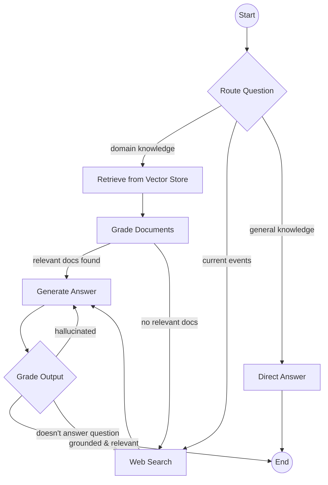

# 01 — Adaptive RAG

An intelligent retrieval-augmented generation agent built with **LangGraph** that dynamically routes queries across three strategies — vector store retrieval, web search, and direct LLM generation — with built-in document grading and self-correcting output quality gates.

## Architecture



## How It Works

### 1. Query Routing
An LLM classifier examines the incoming question and picks the best retrieval strategy:
- **Vectorstore** — for questions about LLM agents, prompt engineering, or RAG (the topics covered by our knowledge base)
- **Web search** — for anything requiring current or recent information
- **Direct** — for simple factual questions that don't need retrieval

### 2. Retrieval
- **Vector store path**: Markdown documents are chunked, embedded with `text-embedding-3-small`, and stored in an in-memory Chroma collection. The top-k chunks are retrieved by semantic similarity.
- **Web search path**: Tavily Search API returns the most relevant web snippets.

### 3. Document Grading
Each retrieved document is individually scored for relevance by a grading chain. Irrelevant documents are discarded. If *no* documents survive grading, the system automatically falls back to web search.

### 4. Generation
The surviving documents are formatted into a RAG prompt and passed to `gpt-4o-mini` for answer generation.

### 5. Self-Correction (Quality Gate)
A two-stage quality check runs after every generation:
1. **Hallucination check** — is the answer grounded in the retrieved documents? If not, regenerate.
2. **Answer relevance check** — does the answer actually address the question? If not, fall back to web search for better context.

A retry counter (default max 3) prevents infinite loops.

## Project Structure

```
01_adaptive_rag/
├── adaptive_rag/
│   ├── __init__.py
│   ├── state.py        # Graph state (TypedDict)
│   ├── chains.py       # LLM chains — router, graders, generators
│   ├── retriever.py    # Chroma vector store construction
│   ├── nodes.py        # Graph node functions
│   ├── edges.py        # Conditional edge functions
│   └── graph.py        # Graph assembly & compilation
├── docs/               # Knowledge base (markdown → vector store)
│   ├── llm_agents.md
│   ├── prompt_engineering.md
│   └── rag_overview.md
├── main.py             # Entry point with demo questions
├── requirements.txt
├── .env.example
└── README.md
```

## Setup

```bash
# 1. Create and activate a virtual environment
python -m venv .venv
source .venv/bin/activate   # Windows: .venv\Scripts\activate

# 2. Install dependencies
pip install -r requirements.txt

# 3. Configure API keys
cp .env.example .env
# Edit .env and add your OPENAI_API_KEY and TAVILY_API_KEY
```

## Usage

```bash
cd projects/01_adaptive_rag
python main.py
```

The demo runs three questions that exercise each routing path:

| Question | Expected Route |
|---|---|
| "What are the different types of memory in LLM-based agents?" | Vectorstore |
| "Who won the most recent Super Bowl and what was the score?" | Web Search |
| "What is the capital of France?" | Direct |

## Key Concepts Demonstrated

| Concept | Where |
|---|---|
| **State management** | `state.py` — typed shared state flowing through the graph |
| **Conditional routing** | `edges.py` — LLM-powered routing at entry and after grading |
| **Tool integration** | `nodes.py` — Tavily web search as an external tool |
| **RAG pipeline** | `retriever.py` + `nodes.py` — chunking, embedding, retrieval |
| **Structured output** | `chains.py` — Pydantic models for type-safe LLM responses |
| **Self-correction loops** | `edges.py:grade_generation` — hallucination & relevance retry |
| **Graph composition** | `graph.py` — declarative node/edge assembly |
